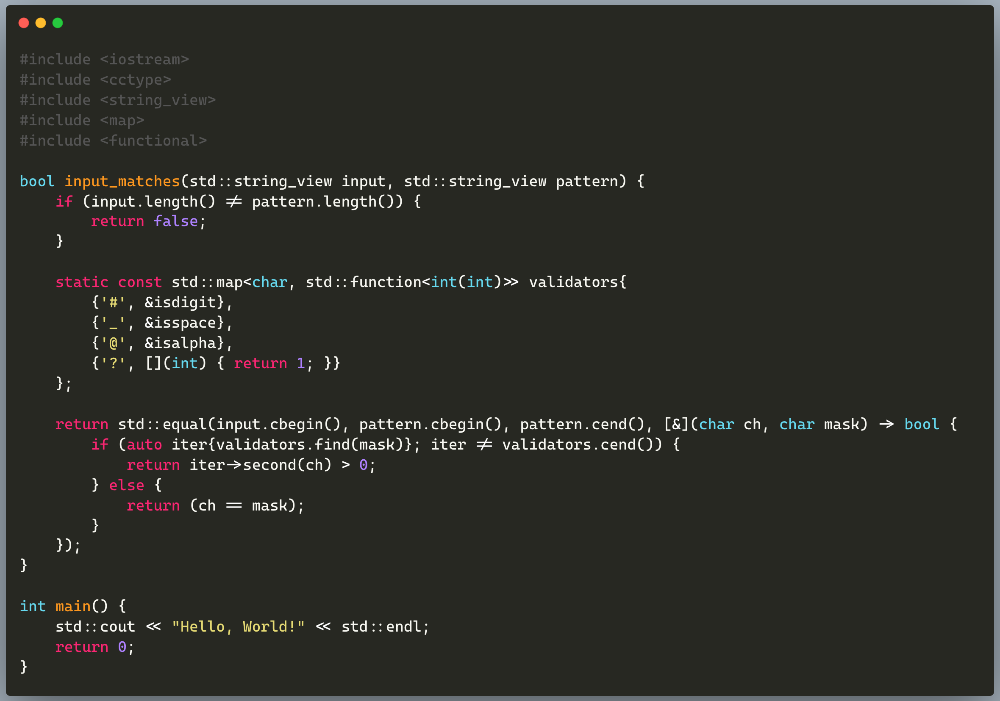
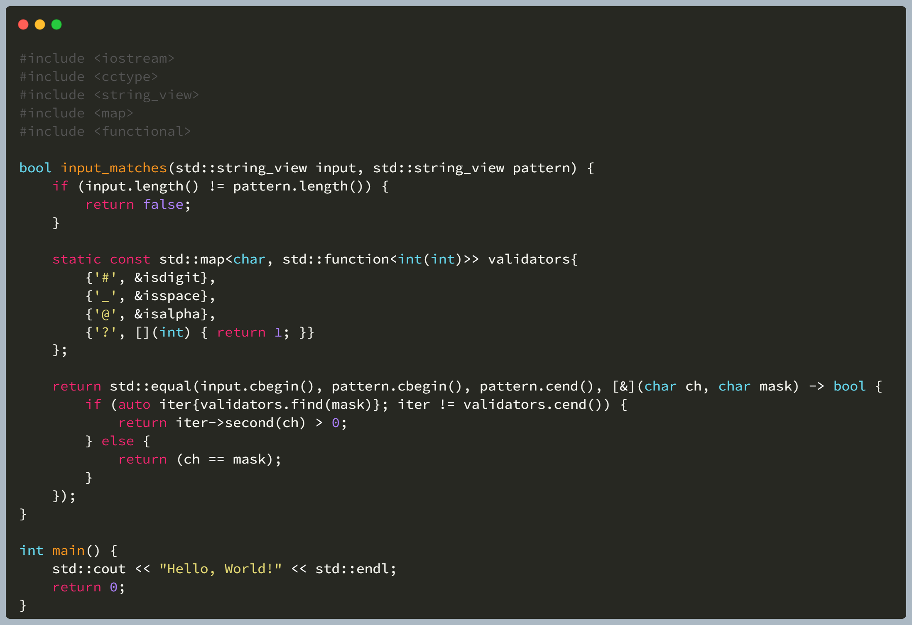

# Cascadia Code

https://github.com/microsoft/cascadia-code

# Fira Code

https://github.com/tonsky/FiraCode

# Hack

https://github.com/source-foundry/Hack

# JetBrains Mono

https://github.com/JetBrains/JetBrainsMono

# monoid

https://github.com/larsenwork/monoid

# Ubuntu Fonts Family

https://design.ubuntu.com/font

Ubuntu：

UbuntuMono：

# source code pro

https://github.com/adobe-fonts/source-code-pro

# Intel One Mono

https://github.com/intel/intel-one-mono

# IBM Plex Mono

https://fonts.google.com/specimen/IBM+Plex+Mono

# MonaspaceArgon

https://github.com/githubnext/monaspace

# Inconsolata

https://fonts.google.com/specimen/Inconsolata

