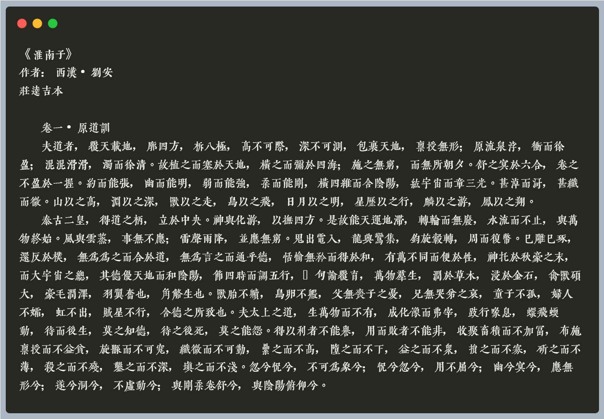
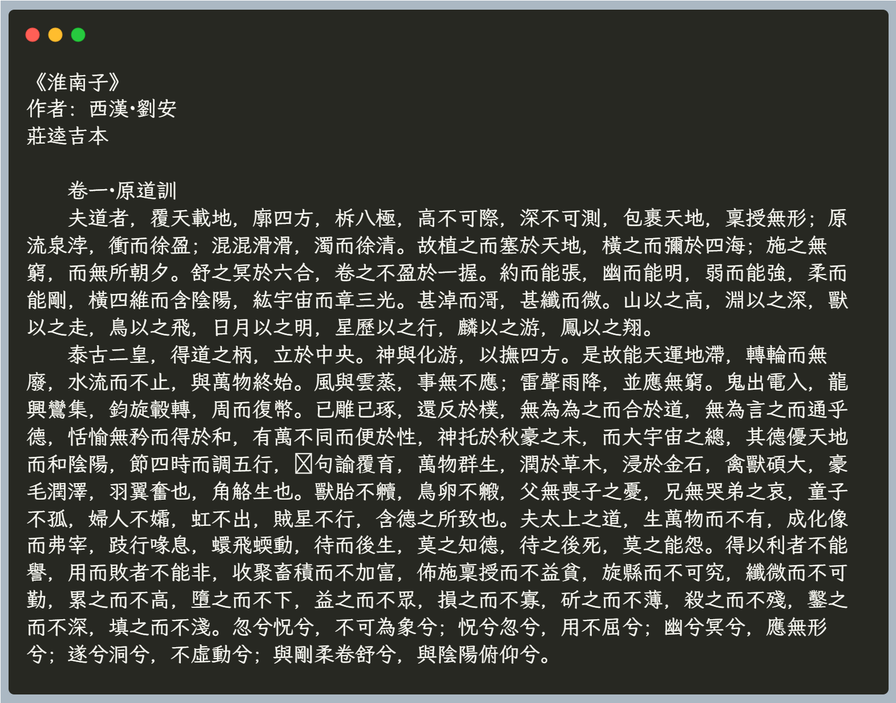
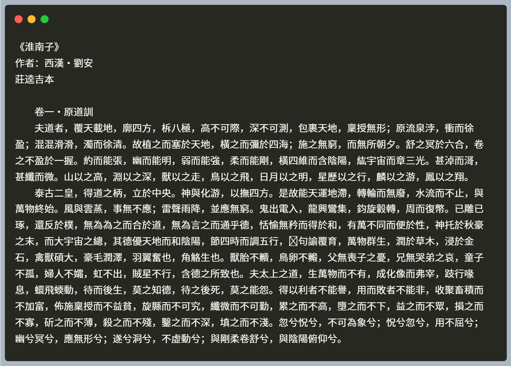
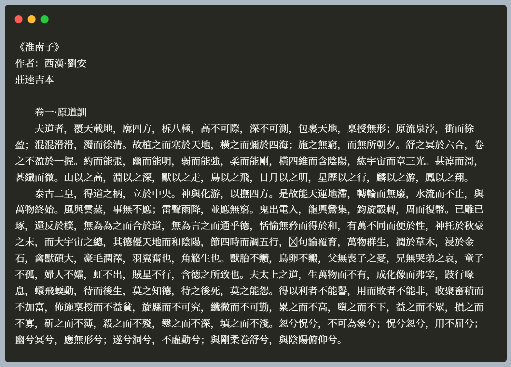

# 齐伋字体

https://github.com/LingDong-/qiji-font

# 霞鹜文楷

https://github.com/lxgw/LxgwWenKai

# 思源黑体

https://github.com/adobe-fonts/source-han-sans

# 思源宋体

https://github.com/adobe-fonts/source-han-serif

https://source.typekit.com/source-han-serif/cn/

