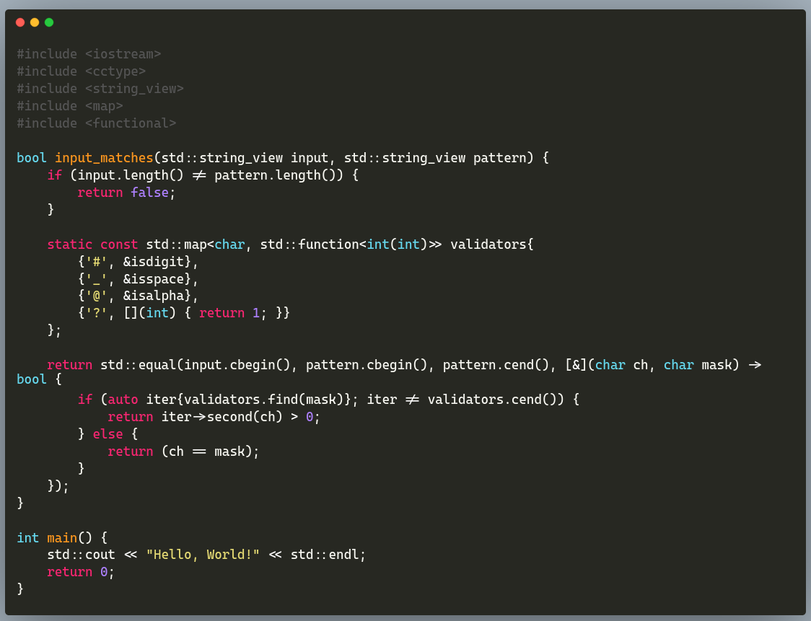
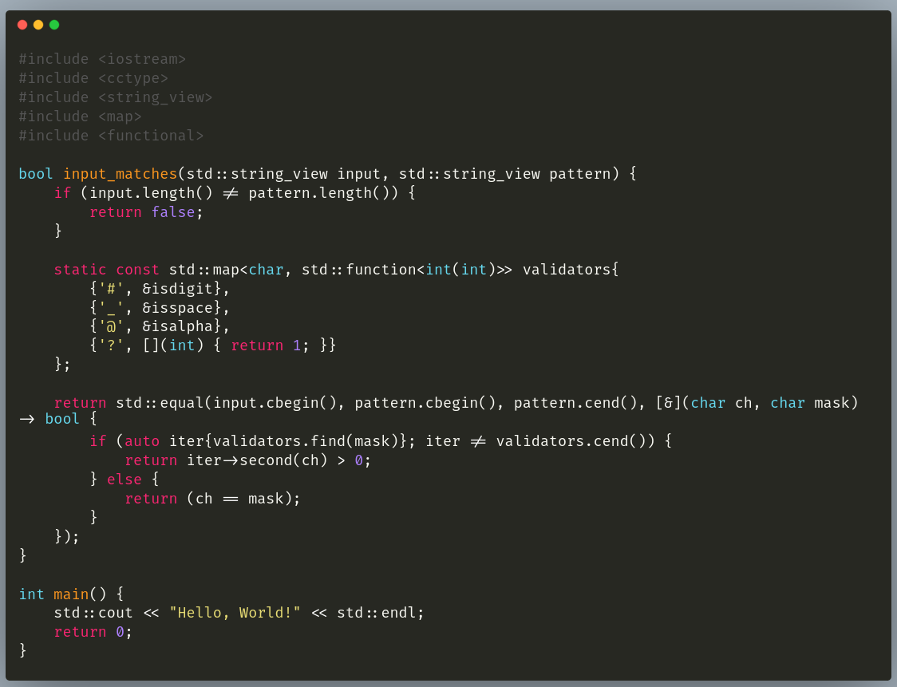
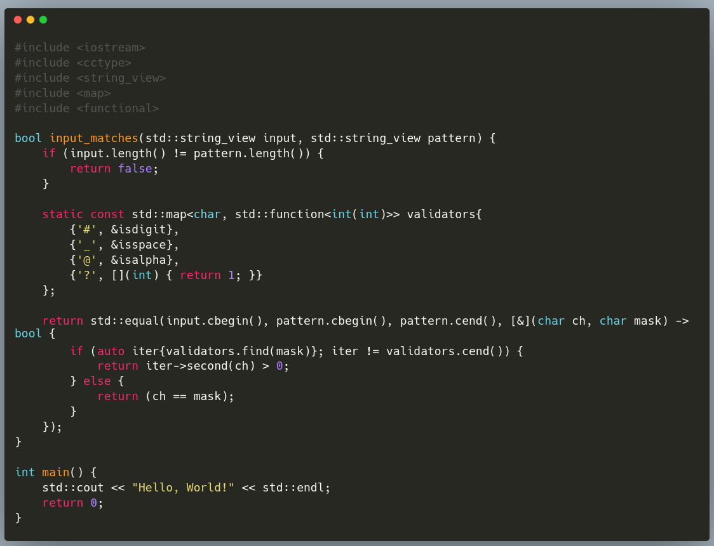
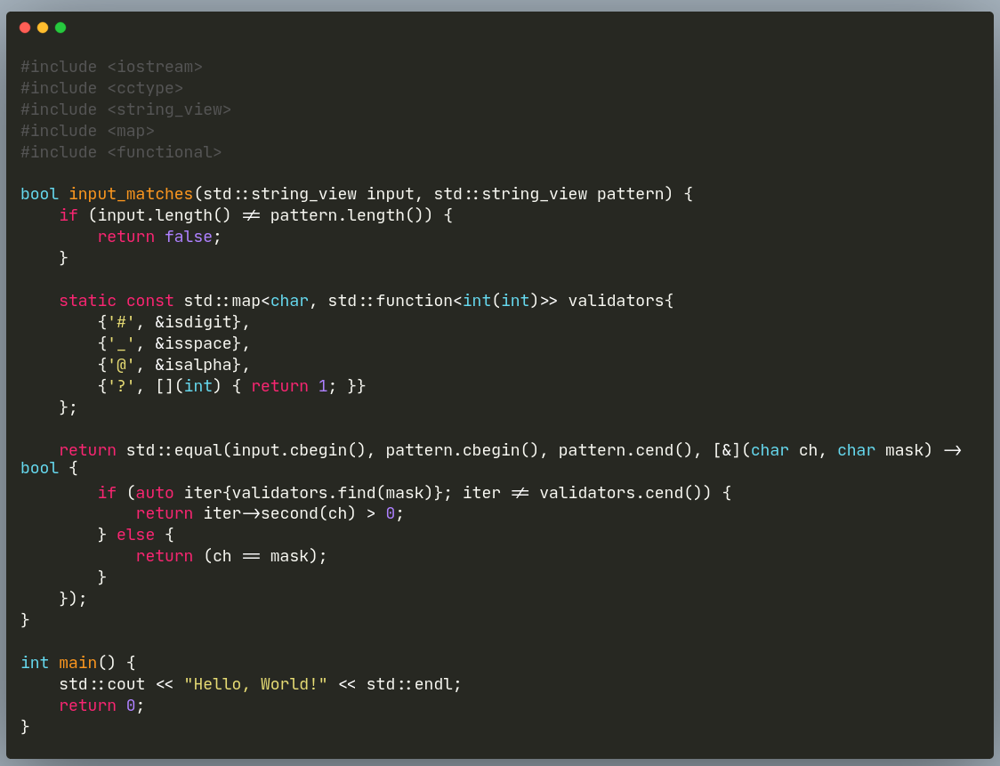

# Cascadia

https://github.com/microsoft/cascadia-code

# Fira Code

https://github.com/tonsky/FiraCode

# Hack

https://github.com/source-foundry/Hack

# JetBrains Mono

https://github.com/JetBrains/JetBrainsMono

# monoid

https://github.com/larsenwork/monoid

[monoid](imgs/monoid.png)

# Ubuntu Fonts Family

https://design.ubuntu.com/font

Ubuntu：

[ubuntu](imgs/ubuntu.png)

UbuntuMono：

[ubuntu_mono](imgs/ubuntu_mono.png)

# source code pro

https://github.com/adobe-fonts/source-code-pro

[source_code_pro](imgs/source_code_pro.png)